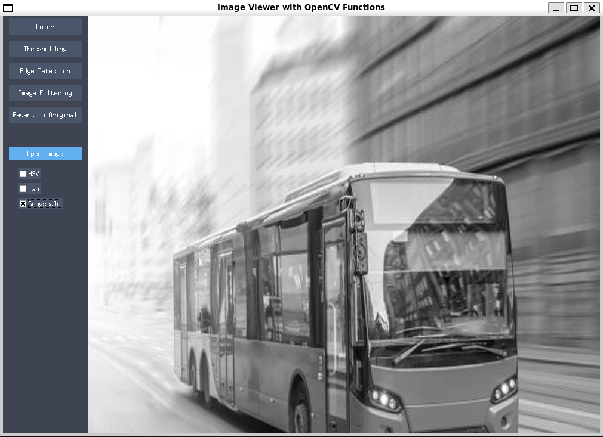

# OpenCV Image Viewer

## Table of Contents

- [Description](#description)
- [Features](#features)
- [Usage](#usage)
- [Dependencies](#dependencies)

## Description

This application provides a user-friendly interface for applying common image processing techniques to images. It allows users to load images, apply color conversions (HSV, Lab, Grayscale), perform thresholding, detect edges (Canny, Sobel), apply filters (blur, sharpen), and extract SIFT features. The application is built using Python's Tkinter for the graphical user interface and OpenCV for image processing functionalities.

## Features

- **Image Loading:** Supports loading images in various formats (jpg, jpeg, png, bmp, gif).
- **Color Conversions:** Convert images between BGR, HSV, Lab, and Grayscale color spaces.
- **Thresholding:** Apply different thresholding methods (Binary, Binary Inverted, Truncate, To Zero, To Zero Inverted) with adjustable threshold and max values.
- **Edge Detection:** Perform Canny and Sobel edge detection with adjustable parameters.
- **Image Filtering:** Apply blur and sharpen filters with adjustable kernel sizes.
- **SIFT Feature Extraction:** Extract and visualize SIFT keypoints with options to show location, size, and orientation.
- **Revert to Original:** Easily revert the image to its original state.
- **User-friendly Interface:** Intuitive graphical interface for easy operation.

## Screenshots



## Installation

1.  **Clone the repository:**

    ```bash
    git clone https://github.com/avinashkella/OIV.git
    ```

2.  **Navigate to the project directory:**

    ```bash
    cd OIV
    ```

3.  **Create a virtual environment (recommended):**

    ```bash
    python3 -m venv venv
    source venv/bin/activate  # On Linux/macOS
    venv\Scripts\activate  # On Windows
    ```

4.  **Install the dependencies:**

    ```bash
    pip install -r requirements.txt
    ```

## Usage

1.  Run the application:

    ```bash
    python main.py
    ```

2.  Click "Open Image" to load an image.
3.  Use the menu options on the left to apply various image processing operations.

## Dependencies

-   Python 3.x
-   OpenCV (cv2)
-   Tkinter
-   Pillow (PIL)
-   NumPy

## Next Steps (Future)
The purpose of this tool is to gain hands-on experience with OpenCV functions, observe the effects of parameters on images, and determine the optimal settings for an image. Enhance the tool further by these:

- Adding more OpenCV functions in menu and perform real time image processing.
- Use LLM to Generate python code automatically on right side by passing the list of operations.
- Saving the processed image to a file for data labeling (specially for medical image segmentation).

This project is an excellent starting point for understanding the OpenCV functions and integration of OpenCV with Tkinter.
